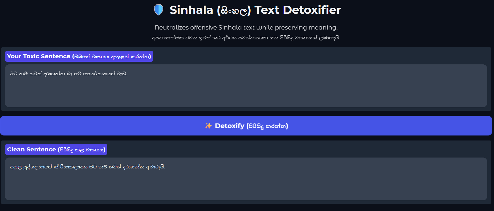
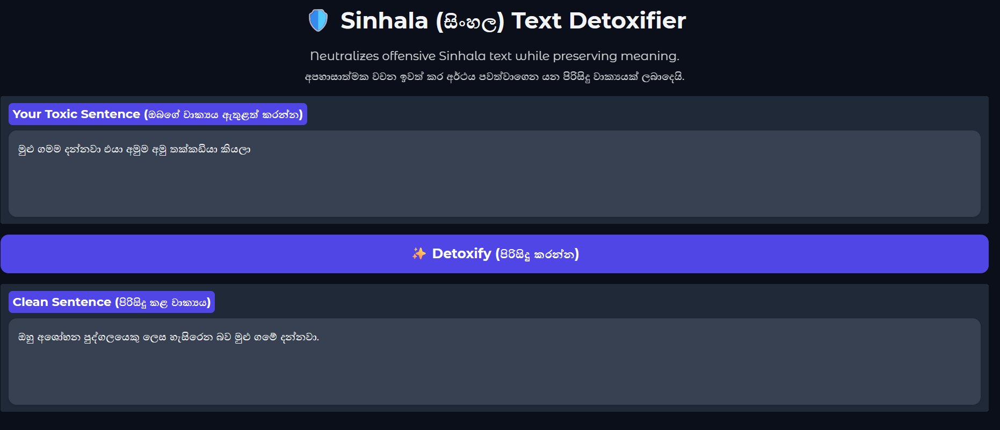
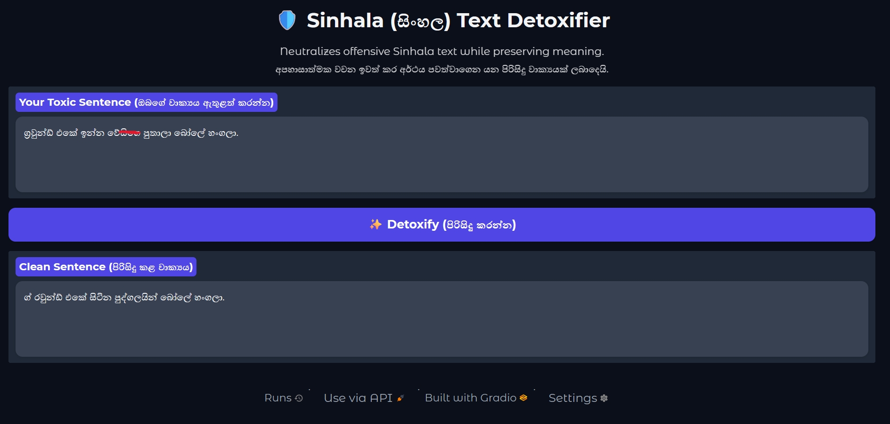

# 🛡️ Sinhala Text Detoxifier

This is a deep learning-based text generation application built to neutralize offensive and hate speech in the Sinhala language. It automatically rewrites toxic sentences into polite, normal sentences while strictly preserving the original semantic meaning and context of the author. The model is fine-tuned using the **mT5-base** architecture combined with **LoRA** (Low-Rank Adaptation) for parameter-efficient sequence-to-sequence generation.

## 🚀 Live Demo (Local Installation)

Follow these steps to run the Web App on your local machine.

### 1. Clone the Repository

git clone https://github.com/dimuthulk/Sinhala-Text-Detoxifier.git
cd Sinhala-Text-Detoxifier

### 2. Create a Virtual Environment (Recommended)

python -m venv venv
# On Windows:
venv\Scripts\activate
# On Mac/Linux:
source venv/bin/activate

### 3. Install Dependencies

pip install -r requirements.txt

### 4. Run the Application

python app.py

Open your web browser and go to the provided local URL (usually http://127.0.0.1:7860).

## 🧠 Model Information

The core AI model is hosted on Hugging Face. The application automatically downloads and caches the model weights upon the first run.

- **Model URL:** [dimuthulk/sinhala-detox-mt5-lora](https://huggingface.co/dimuthulk/sinhala-detox-mt5-lora)
- **Base Architecture:** google/mT5-base (580M Parameters)
- **Optimization:** PEFT / LoRA (Low-Rank Adaptation)
- **Task:** Text Style Transfer / Sequence-to-Sequence Generation

## 🛠️ Built With

- [Transformers (Hugging Face)](https://huggingface.co/)
- [PEFT (Hugging Face)](https://huggingface.co/docs/peft/index)
- [PyTorch](https://pytorch.org/)
- [Gradio](https://gradio.app/) (For the User Interface)